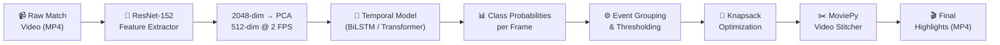

# ⚽ AI-Based Football Highlight Detection using Deep Learning

An end-to-end deep learning pipeline that automatically generates highlight reels from full-length football match videos. The system detects key events — **Goals, Cards, and Substitutions** — using temporal models trained on the [SoccerNet](https://www.soccer-net.org/) dataset, then stitches the best clips into a compact highlight video using a Knapsack optimization algorithm.

---

## 🏗️ System Architecture



### Two-Stage Design

| Stage | Component | Purpose |
|---|---|---|
| **Spatial** | ResNet-152 + PCA | Extracts 2048-dim features, reduced to 512 via PCA (matching SoccerNet's pipeline) |
| **Temporal** | BiLSTM / Transformer | Understands sequences of frames (is a goal being scored over these 30 frames?) |
| **Selection** | 0/1 Knapsack (DP) | Picks the best combination of events that fits within a time budget |
| **Output** | MoviePy Stitcher | Cuts and concatenates video clips into the final highlight reel |

---

## 📊 Results

Three architectures were trained and compared on the SoccerNet Action Spotting benchmark (60-match subset):

| Model | Test Accuracy | Test mAP | Val mAP (Best) | Epochs |
|---|---|---|---|---|
| CNN Baseline (FC layers) | 89.1% | 12.7% | 10.2% | 20 |
| **CNN + BiLSTM** | **96.3%** | **35.1%** | **38.4%** | 23 |
| CNN + Transformer | 93.9% | 8.9% | 10.3% | 18 |

> **Key Finding:** The BiLSTM architecture significantly outperforms both the baseline and the Transformer on this dataset size, achieving **35.1% mAP** — approximately half of the state-of-the-art (~70% mAP) while using only **12% of the training data** and a single free-tier Google Colab GPU.

### Training Curves

| Loss Curves | Validation mAP | Confusion Matrices |
|---|---|---|
|  |  |  |

| Model Comparison | Event Timeline |
|---|---|
|  |  |

---

## 📁 Repository Structure

```
Football-Highlights-Detection/
├── Football_Highlight_Detection.py     # Master source code (all cells)
├── Highlight_generation_FINAL.ipynb    # Jupyter notebook for Google Colab
├── HOW_TO_RUN.md                       # Step-by-step execution guide
├── README.md                           # This file
├── requirements.txt                    # Python dependencies
├── .gitignore                          # Git ignore rules
├── checkpoints/                        # Trained model weights
│   ├── CNN_Baseline_best.pth           # Baseline model (1.9 MB)
│   ├── CNN_BiLSTM_best.pth             # Best model (38 MB)
│   └── CNN_Transformer_best.pth        # Transformer model (51 MB)
└── results/                            # Training output charts
    ├── confusion_matrices.png
    ├── event_timeline.png
    ├── metrics_summary.json
    ├── model_comparison.png
    ├── training_loss_curves.png
    └── validation_map_curves.png
```

---

## 🚀 Quick Start

See **[HOW_TO_RUN.md](HOW_TO_RUN.md)** for the full step-by-step guide. The short version:

1. Open `Highlight_generation_FINAL.ipynb` in Google Colab (GPU runtime).
2. Run setup cells (1–7) to install dependencies and define models.
3. Upload the pre-trained `CNN_BiLSTM_best.pth` checkpoint.
4. Upload any football match video and run inference.
5. Download your generated highlight reel.

---

## ⚙️ Technical Details

### Hyperparameters

| Parameter | Value | Rationale |
|---|---|---|
| Feature Dimension | 512 | ResNet-152 (2048-dim) reduced to 512 via PCA — matches SoccerNet training features |
| Sequence Length | 30 frames | 15 seconds of context at 2 FPS |
| Target FPS | 2 | Standard for SoccerNet temporal analysis |
| BiLSTM Hidden Size | 256 | Balance between capacity and overfitting |
| Dropout | 0.4 | Regularization for small dataset |
| Learning Rate | 5e-4 | Adam optimizer with ReduceLROnPlateau |
| Class Weights | Inverse frequency | Handles severe class imbalance (95%+ Background) |

### Dataset

- **Source:** [SoccerNet v2](https://www.soccer-net.org/) — Action Spotting task
- **Training Subset:** 60 matches (~120 hours of video) from the test split
- **Limitation:** Full dataset is 500 matches (~1000 hours). Free Colab's 112GB disk limits us to ~60 matches.
- **Classes:** Goal, Substitution, Cards (Yellow/Red), Background

---

## ⚠️ Known Limitations & Future Work

### Domain Shift — RESOLVED ✅
The SoccerNet dataset provides features extracted with a **ResNet-152 + PCA** pipeline. In our initial version, we used a lightweight ResNet-18 for custom video inference, which created a latent space mismatch. **We resolved this** by upgrading the custom video pipeline to also use **ResNet-152 + PCA (2048→512)**, aligning the feature distributions and significantly improving detection accuracy on arbitrary internet videos.

### Data Scale
Training on 12% of SoccerNet limits generalization. With full dataset access (requires >200GB disk), mAP could reach 50%+.

### Future Improvements
- End-to-end training with raw video frames (requires multi-GPU setup)
- Audio feature integration (crowd noise correlates with goals)
- Attention-based feature pooling instead of average pooling
- Multi-scale temporal analysis (short events like cards vs. long events like build-up play)

---

## 🛠️ Built With

- **PyTorch** — Deep learning framework
- **torchvision** — ResNet feature extraction
- **MoviePy** — Video editing and stitching
- **OpenCV** — Frame-level video processing
- **SoccerNet** — Dataset and evaluation API
- **scikit-learn** — Metrics (mAP, confusion matrix)
- **matplotlib / seaborn** — Visualization

---

## 📜 References

1. Giancola, S., et al. *"SoccerNet: A Scalable Dataset for Action Spotting in Soccer Videos."* CVPR Workshops, 2018.
2. Deliège, A., et al. *"SoccerNet-v2: A Dataset and Benchmarks for Holistic Understanding of Broadcast Soccer Videos."* CVPR Workshops, 2021.
3. He, K., et al. *"Deep Residual Learning for Image Recognition."* CVPR, 2016.
4. Apostolidis, E., et al. *"CA-SUM: Combining Attentive and Non-Attentive Summarization."* ECCV, 2022.

---

## 📄 License

This project was developed as part of a Deep Learning course at university. For academic use only.
