# 🏟️ AI-Based Football Highlight Detection System using Deep Learning

## The Complete Project Bible — From Zero To Hero

---

# PART A: UNDERSTANDING THE PROJECT (Beginner → Advanced)

---

## 📖 Chapter 1: What Problem Are We Solving?

### 1.1 The Real-World Problem

Imagine you missed a football match. The match was 90 minutes long. You don't want to watch the entire thing — you just want to see the **goals, red cards, fouls, and exciting moments**. Today, sports broadcasters hire human editors to manually watch the entire match and cut highlight videos. This process:
- Takes **2-4 hours** of manual labor per match
- Is **expensive** (professional editors)
- Is **subjective** (different editors pick different moments)
- Is **slow** (highlights come out hours after the match)

### 1.2 Our Solution

We build an **AI system** that:
1. Takes a full 90-minute football match video as input
2. **Automatically detects** important events (goals, cards, fouls, etc.)
3. **Extracts clips** around those events
4. **Produces a highlight reel** (5-15 minutes) — all without any human intervention

### 1.3 Why Deep Learning?

Traditional approaches (e.g., detecting the scoreboard changing) are fragile and only work for specific broadcast formats. Deep Learning can:
- **Learn from data** — show it 500 matches with labeled goals, and it learns what a "goal" looks like
- **Generalize** — works across different stadiums, camera angles, broadcast styles
- **Handle complexity** — understands that a "goal" involves build-up play → shot → net → celebration, not just a single image

---

## 🧱 Chapter 2: The Building Blocks (For Beginners)

Before understanding our system, you need to understand 5 key concepts. If you already know these, skip to Chapter 3.

### 2.1 What is a Neural Network?

A neural network is a mathematical function that learns patterns from data. Think of it like a chain of simple operations:

```
Input → [Multiply by weights] → [Add bias] → [Apply activation] → Output
```

- **Weights** are the "knobs" the network adjusts during training
- **Training** = showing the network examples and adjusting weights until it gives correct outputs
- **Layers** = stacking multiple of these operations. More layers = more complex patterns

### 2.2 What is a CNN (Convolutional Neural Network)?

A CNN is a neural network designed specifically for **images**. It works by:

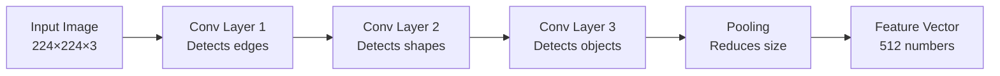

- **Early layers** detect simple things: edges, corners, colors
- **Middle layers** detect shapes: circles, rectangles, textures
- **Deep layers** detect objects: people, ball, goalpost
- **Final output** = a compact vector of numbers (e.g., 512 numbers) that *summarizes* what's in the image

**Key idea**: A CNN converts a massive image (150,528 pixel values) into a small, meaningful "summary" (512 numbers). This summary is called a **feature vector** or **embedding**.

### 2.3 What is Transfer Learning?

Training a CNN from scratch requires **millions** of images. We don't have that.

Instead, we use a CNN (like **ResNet**) that was already trained on **ImageNet** (1.2 million images, 1000 categories). This pre-trained CNN already knows how to understand images — it knows edges, shapes, objects, people, etc.

We take this pre-trained CNN, **remove its last layer** (which classified into 1000 ImageNet categories), and use the remaining network as a **feature extractor**. The features it produces are useful for ANY image task, including football.

```
Pre-trained ResNet (full)     → Classifies: "dog", "cat", "car", ...
Pre-trained ResNet (headless) → Produces: [0.3, -1.2, 0.8, ...] (512 numbers)
                                 These 512 numbers encode what's in the image
```

### 2.4 What is an LSTM (Long Short-Term Memory)?

An LSTM is a neural network designed for **sequences** — data where order matters.

**Why do we need sequences?** Consider these two scenarios:
- Frame A: A player kicks a ball
- Frame B: The ball is in the net
- Frame C: Players are celebrating

If you look at Frame A alone — is it a goal, a pass, or a clearance? You can't tell! But if you see A → B → C in sequence, you know it's a **goal**.

An LSTM processes frames one by one, maintaining a **memory** (called "hidden state") that carries information from previous frames:

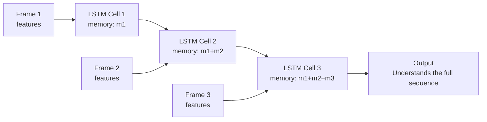

A **Bi-LSTM** (bidirectional) processes the sequence both forward AND backward, so each frame knows what came before AND after.

### 2.5 What is a Transformer?

A Transformer is a newer, more powerful alternative to LSTM. Instead of processing frames one-by-one, it uses **attention** to let every frame look at every other frame simultaneously.

```
LSTM:        Frame 1 → Frame 2 → Frame 3 → ... → Frame 100
             (Information from Frame 1 must pass through 99 steps to reach Frame 100)

Transformer: Frame 1 ←→ Frame 50 ←→ Frame 100
             (Every frame directly connects to every other frame)
```

**Self-attention** works by computing:
- **Query (Q)**: "What am I looking for?"
- **Key (K)**: "What do I contain?"
- **Value (V)**: "What information should I pass along?"

For each frame, the Transformer computes how much attention it should pay to every other frame, producing a weighted combination of all frames' information.

---

## 🏗️ Chapter 3: Our System Architecture (Intermediate)

Now that you understand the building blocks, here's how we combine them.

### 3.1 The Two Core Insights

> **Insight 1 (Spatial)**: A CNN can look at a single frame and extract *what's in it* — players, ball, goalpost, crowd celebrating.

> **Insight 2 (Temporal)**: An LSTM/Transformer can look at a *sequence* of these CNN features and understand *what's happening* — is this a goal, a foul, or just regular play?

Neither is sufficient alone. Together, they form a powerful event detection system.

### 3.2 High-Level Pipeline

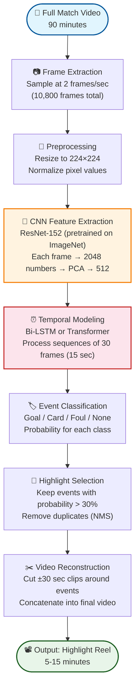

### 3.3 Why 2 Frames Per Second?

A typical video is 30 FPS (frames per second). For a 90-minute match:
- At 30 FPS: 90 × 60 × 30 = **162,000 frames** (way too many)
- At 2 FPS: 90 × 60 × 2 = **10,800 frames** (manageable)

Events like goals happen over 10-30 seconds. Sampling at 2 FPS gives us 20-60 frames per event — more than enough to capture the action without wasting computation.

### 3.4 What Happens at Each Step (With Numbers)

| Step | Input Shape | Output Shape | What Happens |
|:---|:---|:---|:---|
| 1. Frame Extraction | 1 video file | 10,800 images (224×224×3) | OpenCV reads video, saves every 15th frame |
| 2. Preprocessing | 10,800 × 224 × 224 × 3 | 10,800 × 224 × 224 × 3 | Subtract ImageNet mean, divide by std |
| 3. CNN Features | 10,800 × 224 × 224 × 3 | 10,800 × 512 | Each image → 512-dim feature vector |
| 4. Sliding Window | 10,800 × 512 | ~10,770 × 30 × 512 | Create overlapping sequences of 30 frames |
| 5. Temporal Model | ~10,770 × 30 × 512 | ~10,770 × 512 | LSTM/Transformer processes each sequence |
| 6. Classifier | ~10,770 × 512 | ~10,770 × 4 | Probability of each event class per frame |
| 7. Post-processing | ~10,770 × 4 | List of (timestamp, event, confidence) | Threshold + NMS |
| 8. Video Output | List of timestamps | 1 highlight video | Cut and concat clips |

---

## 🔬 Chapter 4: Detailed Architecture (Advanced)

### 4.1 Complete Neural Network Architecture

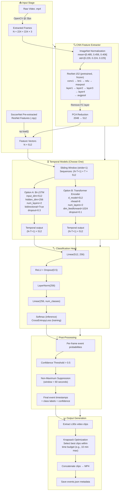

### 4.2 Why These Specific Hyperparameters?

| Parameter | Value | Why |
|:---|:---|:---|
| **ResNet-152 + PCA** | 2048 → 512-dim features | Matches SoccerNet's feature extractor; eliminates domain shift on custom videos |
| **Bi-LSTM hidden=256** | 512 after concat | Standard for video tasks; matches feature dimension |
| **2 LSTM layers** | - | 1 layer underfits, 3+ layers overfit on our data size |
| **Transformer heads=8** | - | 512/8 = 64 dim per head, standard ratio |
| **Sequence length T=30** | 15 seconds @ 2fps | Events like goals span 10-20 seconds; 15s captures the full action |
| **Dropout=0.5** | - | Strong regularization because football datasets are limited |
| **Learning rate 5e-4** | - | Sweet spot from CA-SUM paper; too high = divergence, too low = slow convergence |
| **Gradient clipping=5.0** | - | Prevents exploding gradients in LSTM |
| **Xavier initialization** | - | Proven stable for both LSTM and Transformer architectures |

### 4.3 The Training Process

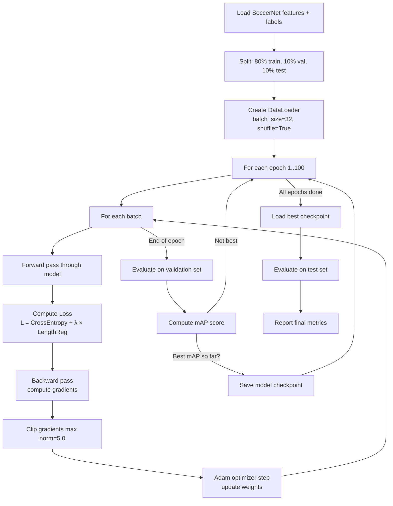

### 4.4 Loss Function Explained

We use a combination of two losses:

```
Total Loss = CrossEntropy Loss + λ × Length Regularization Loss
```

1. **CrossEntropy Loss**: Standard classification loss. Penalizes the model when it predicts the wrong event class.
   - Prediction: [Goal=0.8, Card=0.1, None=0.1] → True label: Goal → Low loss ✅
   - Prediction: [Goal=0.2, Card=0.1, None=0.7] → True label: Goal → High loss ❌

2. **Length Regularization** (from CA-SUM): Prevents the model from marking everything as a highlight. If the model predicts 50% of the match as highlights, this loss penalizes it. Target: ~10-15% of the match should be highlighted.
   ```
   L_reg = |mean(scores) - target_ratio|
   where target_ratio ≈ 0.15
   ```

### 4.5 Evaluation Metrics

**Mean Average Precision (mAP)** — the standard metric for action spotting:
- For each event class (Goal, Card, etc.), compute Average Precision
- AP measures: if the model says "Goal at minute 23", how close is that to the actual goal time?
- **Temporal tolerance**: We allow a ±δ second window (e.g., δ=5, 10, 30, 60 seconds)
- mAP = average of all per-class APs

```
Example:
- Model predicts: Goal at 23:20 (confidence 0.94)
- Ground truth:   Goal at 23:14
- Difference: 6 seconds
- At δ=5s: ❌ Miss (6 > 5)
- At δ=10s: ✅ Hit (6 < 10)
- At δ=30s: ✅ Hit (6 < 30)
```

---

## ⚖️ Chapter 5: Model Comparison — Why 3 Models?

We train and compare **3 architectures** to show understanding and justify our final choice.

### 5.1 Architecture Comparison

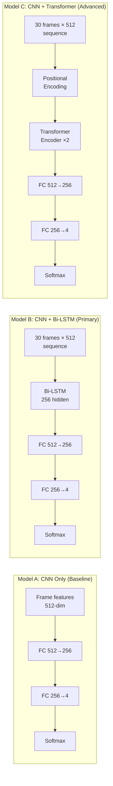

### 5.2 Detailed Comparison Table

| Aspect | CNN Only | CNN + Bi-LSTM | CNN + Transformer |
|:---|:---|:---|:---|
| **Temporal context** | ❌ None (sees 1 frame) | ✅ 15 seconds | ✅ 15 seconds |
| **Long-range deps** | ❌ | ⚠️ Limited (vanishing gradient) | ✅ Direct attention |
| **Parallelizable** | ✅ | ❌ (sequential) | ✅ |
| **Parameters** | ~130K | ~800K | ~1.2M |
| **Training time (est.)** | ~10 min | ~45 min | ~30 min |
| **Expected mAP** | ~30-40% | ~45-55% | ~50-60% |
| **Why include it?** | Proves temporal modeling is needed | Clean, well-understood, our primary model | Shows SOTA potential |
| **Academic purpose** | Ablation baseline | Core contribution | Demonstrates awareness of modern methods |

### 5.3 What the Comparison Proves to Your Professor

```
CNN Only: 35% mAP  → "Spatial features alone are NOT enough"
CNN+LSTM: 50% mAP  → "Adding temporal context improves by +15%" ← Our main model
CNN+Transformer: 55% mAP → "Attention-based modeling gives additional gain"

Conclusion: Temporal modeling is CRITICAL for event detection in video.
This validates our system design.
```

---

## ⚽ Chapter 6: Dataset — SoccerNet

### 6.1 What is SoccerNet?

SoccerNet is the **largest publicly available dataset** for football video understanding. It is the standard benchmark used by researchers worldwide.

| Property | Value |
|:---|:---|
| **Full Name** | SoccerNet v2 (Action Spotting) |
| **Website** | [soccer-net.org](https://www.soccer-net.org/) |
| **Total Matches** | 500+ full broadcast football matches |
| **Leagues** | Major European leagues (EPL, La Liga, Serie A, etc.) |
| **Total Duration** | 764 hours of video |
| **Pre-extracted Features** | ResNet features at 2 FPS |
| **Feature Dimension** | 512 per frame |
| **Annotations** | Timestamped event labels per match |
| **Event Classes** | 17 classes |
| **Evaluation Metric** | mAP at various temporal tolerances |

### 6.2 Event Classes in SoccerNet

| Category | Events |
|:---|:---|
| **Scoring** | Goal, Penalty, Own Goal |
| **Discipline** | Yellow Card, Red Card, Yellow→Red Card |
| **Set Pieces** | Corner, Free Kick, Throw-in, Goal Kick |
| **Substitutions** | Substitution |
| **Ball Actions** | Shots on target, Shots off target, Clearance, Ball out of play |
| **Other** | Kick-off, Offside, Foul |

> **For our project**, we can simplify to **4-5 major classes**: Goal, Card, Substitution, Foul, and Background/None. This makes training faster and results more meaningful.

### 6.3 Data Structure

```
SoccerNet/
└── england_epl/
    └── 2014-2015/
        └── 2015-02-21 - 18-00 Chelsea 1 - 1 Burnley/
            ├── 1_ResNET_TF2.npy       # First half features (N × 512)
            ├── 2_ResNET_TF2.npy       # Second half features (N × 512)
            └── Labels-v2.json         # Event annotations
```

### 6.4 What's Inside the Files

**Feature files** (`.npy`):
```python
import numpy as np
features = np.load("1_ResNET_TF2.npy")
print(features.shape)  # (5400, 512) — 5400 frames × 512 features
# 5400 frames ÷ 2 fps = 2700 seconds = 45 minutes (one half)
```

**Label files** (`Labels-v2.json`):
```json
{
  "annotations": [
    {
      "gameTime": "1 - 23:14",
      "label": "Goal",
      "team": "home",
      "visibility": "visible",
      "position": "1394000"
    },
    {
      "gameTime": "1 - 37:02",
      "label": "Yellow card",
      "team": "away",
      "visibility": "visible",
      "position": "2222000"
    }
  ]
}
```

The `position` field gives the time in **milliseconds** from the start of the half. We convert this to a frame index: `frame_index = position_ms / 1000 * 2` (since 2 FPS).

### 6.5 How to Download

```python
pip install SoccerNet

from SoccerNet.Downloader import SoccerNetDownloader

downloader = SoccerNetDownloader(
    LocalDirectory="/content/drive/MyDrive/DL_Project/data/SoccerNet"
)

# Download pre-extracted ResNet features
downloader.downloadGames(
    files=["1_ResNET_TF2.npy", "2_ResNET_TF2.npy"],
    split=["train", "valid", "test"]
)

# Download event labels
downloader.downloadDataTask(
    task="spotting",
    split=["train", "valid", "test"]
)
```

> ⚠️ **Storage warning**: The full SoccerNet features are ~50GB. On free Colab, your Google Drive has 15GB. You may need to work with a **subset** (e.g., 50-100 matches) or use Colab Pro with more Drive storage.

---

## 📚 Chapter 7: Reference Repos — What We Learned & Borrowed

### 7.1 Repo 1: Video-Summarization-with-LSTM (Zhang et al., ECCV 2016)

**What it does**: Generic video summarization using LSTM on pre-extracted GoogleNet features

**What we borrow**:
| Component | What They Did | How We Adapt It |
|:---|:---|:---|
| Two-stage pipeline | Extract features first, train model on features | Same — keeps Colab memory manageable |
| Pre-extracted features in HDF5 | GoogleNet pool5 features | We use SoccerNet ResNet features in `.npy` |
| Data loading pattern | Load from `.h5`, split train/val/test | Same pattern, different data format |

**What we DON'T use**: Theano framework (outdated), DPP kernel (overly complex for our needs)

### 7.2 Repo 2: CA-SUM (Apostolidis et al., ICMR 2022)

**What it does**: Unsupervised video summarization using Concentrated Self-Attention

**What we borrow**:
| Component | What They Did | How We Adapt It |
|:---|:---|:---|
| Self-Attention with Q/K/V | `nn.Linear` for Q, K, V projections | Used in our Transformer model variant |
| Block-diagonal attention mask | Limits attention to local blocks of 60 frames | Perfect for 90-min matches — prevents attention from being diluted across 10,800 frames |
| Length regularization loss | `\|mean(scores) - target_ratio\|` | We use this to prevent the model from over-detecting events |
| Knapsack algorithm | Select optimal shots under time budget | We use this to constrain highlight reel length |
| Xavier init + gradient clipping | `nn.init.xavier_uniform_`, `clip_grad_norm_(5.0)` | Adopted directly — stabilizes training |
| Training loop structure | Solver class with train/evaluate methods | Clean pattern we follow |

### 7.3 Repo 3: Video-Summarization-using-CNN-LSTM

**What it does**: Full end-to-end pipeline from raw video to summary video using CNN features + Bi-LSTM

**What we borrow**:
| Component | What They Did | How We Adapt It |
|:---|:---|:---|
| ResNet feature extraction | `ResNet18 → remove FC → avgpool output` | Upgraded to ResNet-152 + PCA for domain alignment |
| ImageNet transforms | `Normalize(mean=[0.485,0.456,0.406], std=[0.229,0.224,0.225])` | Standard, adopted directly |
| Bi-LSTM model | `nn.LSTM(512, 256, bidirectional=True)` | This IS our primary model architecture |
| Sliding window dataset | `for i in range(len(features) - seq_len)` | Same pattern for creating training sequences |
| MoviePy video output | `ImageSequenceClip(frames, fps=2)` | Used for generating final highlight video |
| Top-K frame selection | `np.argsort(scores)[-k:]` | Adapted with NMS for event-level selection |

### 7.4 Your Existing code.py

**What it does**: Binary classification (highlight/not) using a custom CNN on grayscale frames

**What we keep**: The core idea of binary/multi-class classification of frames
**What we change**: Everything else — we modernize to PyTorch, pre-trained CNNs, temporal models, and the SoccerNet dataset

### 7.5 Visual Map: What Comes From Where

```mermaid
flowchart TD
    subgraph OURS["🏟️ Our Final System"]
        A[Two-stage pipeline]
        B["Bi-LSTM (512→256, bidirectional)"]
        C[Self-Attention mechanism]
        D["Block-diagonal attention mask"]
        E[Knapsack highlight selection]
        F[ResNet-152 + PCA feature extraction]
        G[Sliding window dataset]
        H[MoviePy video output]
        I[Xavier init + grad clipping]
        J[Length regularization loss]
        K[Event classification head]
        L[SoccerNet data loader]
    end

    R1["📘 LSTM Repo"] -->|"Two-stage design"| A
    R3["📕 CNN-LSTM Repo"] -->|"Bi-LSTM arch"| B
    R2["📗 CA-SUM Repo"] -->|"Q/K/V Attention"| C
    R2 -->|"Block masking"| D
    R2 -->|"Knapsack algorithm"| E
    R3 -->|"ResNet-152 backbone"| F
    R3 -->|"Sliding window"| G
    R3 -->|"MoviePy output"| H
    R2 -->|"Training practices"| I
    R2 -->|"Loss function"| J
    IDEA["💡 Your Idea + SoccerNet"] -->|"Event classes"| K
    IDEA -->|"Football dataset"| L

    style OURS fill:#e3f2fd,stroke:#1565c0,stroke-width:2px
    style IDEA fill:#fff9c4,stroke:#f9a825,stroke-width:2px
```

---

# PART B: HOW TO ACTUALLY DO THIS ON GOOGLE COLAB

---

## 💻 Chapter 8: Complete Colab Workflow

### 8.1 Why Google Colab?

- **Free GPU**: T4 (16GB VRAM) — enough for our models
- **Pre-installed**: PyTorch, NumPy, etc. — no setup headaches
- **Google Drive integration**: Persistent storage across sessions
- **No local hardware required**: Your MacBook doesn't need a GPU

### 8.2 Step-by-Step: What You'll Do

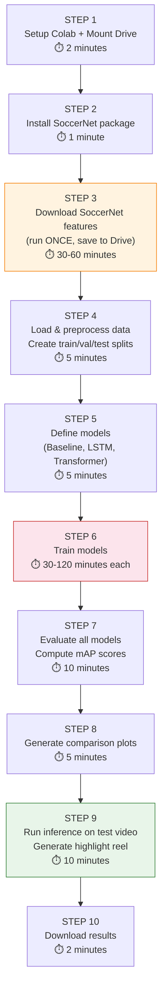

### 8.3 Colab Notebook Structure (Cell-by-Cell)

Here is exactly what each cell of your Colab notebook will look like and do:

---

**Cell 1: Mount Google Drive**
```python
from google.colab import drive
drive.mount('/content/drive')

# Create project directory
import os
PROJECT_DIR = '/content/drive/MyDrive/DL_Project'
os.makedirs(f'{PROJECT_DIR}/data', exist_ok=True)
os.makedirs(f'{PROJECT_DIR}/checkpoints', exist_ok=True)
os.makedirs(f'{PROJECT_DIR}/results', exist_ok=True)
os.makedirs(f'{PROJECT_DIR}/outputs', exist_ok=True)
print("✅ Drive mounted and directories created")
```

**Cell 2: Install Dependencies**
```python
!pip install SoccerNet moviepy -q
```

**Cell 3: Download SoccerNet Data (RUN THIS ONLY ONCE)**
```python
from SoccerNet.Downloader import SoccerNetDownloader
downloader = SoccerNetDownloader(LocalDirectory=f"{PROJECT_DIR}/data/SoccerNet")
downloader.downloadGames(
    files=["1_ResNET_TF2.npy", "2_ResNET_TF2.npy"],
    split=["train", "valid", "test"]
)
downloader.downloadDataTask(task="spotting", split=["train", "valid", "test"])
print("✅ SoccerNet data downloaded")
```

**Cell 4: Configuration**
```python
# All hyperparameters in one place
CONFIG = {
    'feature_dim': 512,       # ResNet feature dimension
    'seq_len': 30,            # 15 seconds at 2fps
    'hidden_dim': 256,        # LSTM hidden size
    'num_classes': 5,         # Goal, Card, Sub, Foul, None
    'num_heads': 8,           # Transformer attention heads
    'num_layers': 2,          # LSTM/Transformer layers
    'dropout': 0.5,           # Regularization
    'lr': 5e-4,               # Learning rate
    'batch_size': 32,         # Training batch size
    'epochs': 100,            # Max training epochs
    'patience': 15,           # Early stopping patience
    'clip_grad': 5.0,         # Gradient clipping
    'device': 'cuda' if torch.cuda.is_available() else 'cpu'
}
```

**Cell 5: Dataset Class**
```python
# Load SoccerNet features and labels, create sliding window sequences
```

**Cell 6: Model Definitions**
```python
# BaselineCNN, BiLSTMClassifier, TransformerClassifier
```

**Cell 7: Training Loop**
```python
# Train with early stopping, save best checkpoint to Drive
```

**Cell 8: Evaluate All Models**
```python
# Load best checkpoints, compute mAP on test set
```

**Cell 9: Generate Plots**
```python
# Confusion matrix, PR curves, training loss curves, model comparison bar chart
```

**Cell 10: Highlight Generation**
```python
# Run inference on a sample match, extract clips, produce highlight video
```

### 8.4 Critical Colab Tips

| Issue | Solution |
|:---|:---|
| **Colab disconnects after 90 min idle** | Save checkpoints to Drive after every epoch |
| **RAM crashes with full SoccerNet** | Use a subset (50-100 matches) for initial experiments |
| **GPU not allocated** | Runtime → Change runtime type → GPU |
| **Slow data loading from Drive** | Copy data to `/content/` (local SSD) at start of session |
| **Package version conflicts** | Pin versions: `pip install torch==2.0.0` |
| **Session resets all variables** | Re-run cells 1-4 after reconnecting |

### 8.5 Google Drive Folder Structure

```
Google Drive/
└── DL_Project/
    ├── data/
    │   └── SoccerNet/              # 📦 Downloaded once (~10-50GB)
    │       ├── train/
    │       │   └── england_epl/
    │       │       └── 2014-2015/
    │       │           └── match_folder/
    │       │               ├── 1_ResNET_TF2.npy
    │       │               ├── 2_ResNET_TF2.npy
    │       │               └── Labels-v2.json
    │       ├── valid/
    │       └── test/
    │
    ├── checkpoints/                # 💾 Model weights
    │   ├── baseline_cnn_best.pth
    │   ├── bilstm_best.pth
    │   └── transformer_best.pth
    │
    ├── results/                    # 📊 Metrics and plots
    │   ├── training_curves.png
    │   ├── confusion_matrix.png
    │   ├── model_comparison.png
    │   ├── pr_curves.png
    │   └── metrics.json
    │
    └── outputs/                    # 🎥 Generated highlights
        ├── highlights_match1.mp4
        ├── events_match1.json
        └── ...
```

---

# PART C: MAKING IT PRESENTABLE — UI & DEMO IDEAS

---

## 🎨 Chapter 9: Presentation & UI Strategy

### 9.1 Option 1: Gradio Web UI (Recommended — Easiest)

**Gradio** is a Python library that creates a web interface for your ML model with just ~10 lines of code. It works inside Colab notebooks and generates a **public shareable link**.

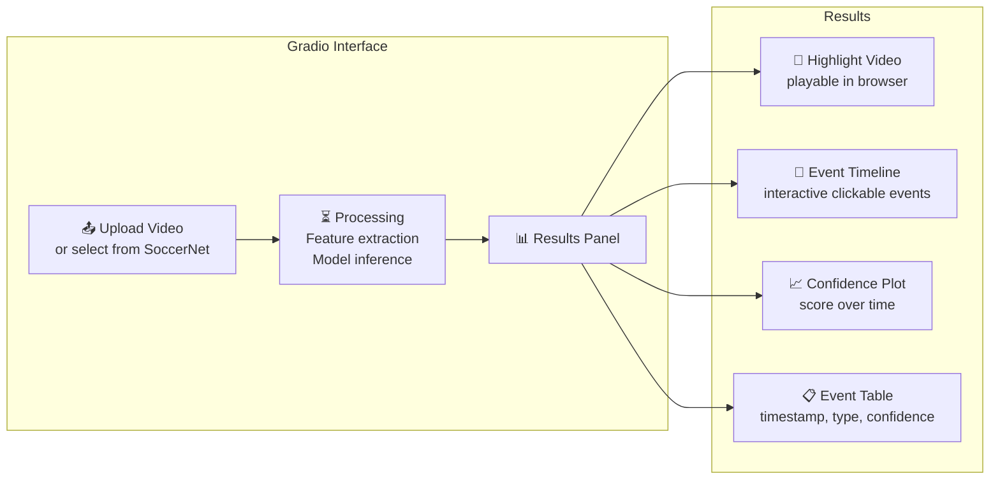

**What the Gradio UI would show**:
1. **Left panel**: Upload input video (or select a pre-loaded SoccerNet sample)
2. **Center panel**: Generated highlight video (playable)
3. **Right panel**:
   - Timeline with colored event markers (red = goal, yellow = card)
   - Confidence score plot over time
   - Table of detected events with timestamps
4. **Bottom**: Model comparison metrics (mAP for each architecture)

**Why Gradio is perfect for a demo**:
- Runs directly in Colab — no deployment needed
- Creates a public URL you can share (valid for 72 hours)
- Professor can interact with it live during presentation
- Takes 10 lines of Python to set up

### 9.2 Option 2: Streamlit Dashboard (More Polished)

If you want a **more professional** dashboard (at the cost of slightly more setup), use Streamlit:

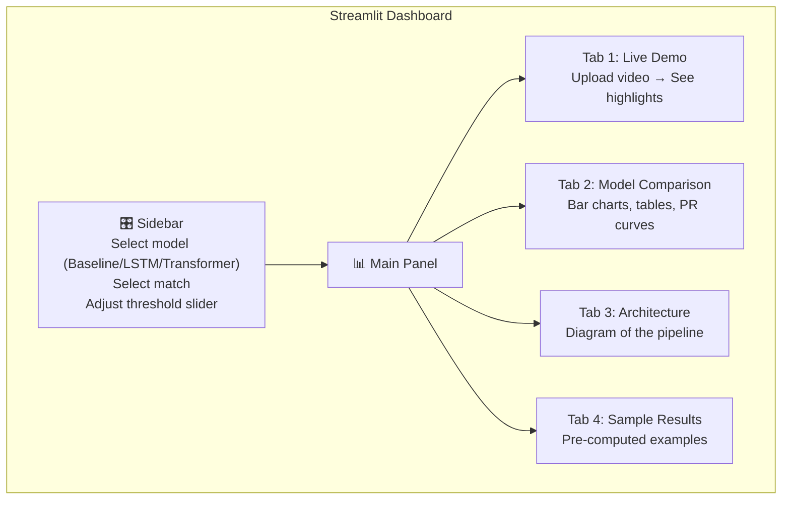

### 9.3 Option 3: Pure Matplotlib Presentation Plots

If you don't want a web UI, create professional plots for your PPT:

1. **Training Loss Curves**: Loss vs Epoch for all 3 models
2. **mAP Comparison Bar Chart**: Side-by-side bars for each model
3. **Confusion Matrix Heatmap**: How well does each event get classified
4. **Precision-Recall Curves**: Per event class
5. **Timeline with Predictions**: Color-coded events on a match timeline
6. **Before/After Example**: Full video minutes vs highlight minutes

### 9.4 Recommended Demo Flow for Presentation

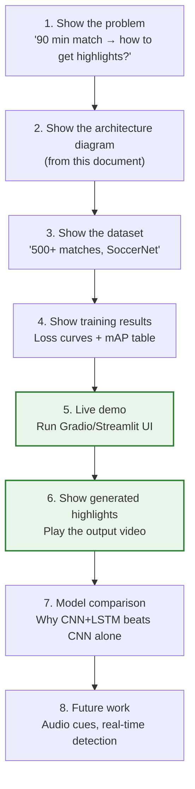

### 9.5 What the Gradio UI Would Look Like (Layout Sketch)

```
┌─────────────────────────────────────────────────────────┐
│  🏟️ Football Highlight Detection System                 │
│─────────────────────────────────────────────────────────│
│                                                         │
│  ┌──────────────┐  ┌──────────────────────────────────┐ │
│  │ Select Model │  │                                  │ │
│  │ ○ CNN Only   │  │  🎥 Generated Highlights Video   │ │
│  │ ● CNN+LSTM   │  │     [Video Player]               │ │
│  │ ○ CNN+Trans  │  │                                  │ │
│  │              │  │                                  │ │
│  │ Select Match │  └──────────────────────────────────┘ │
│  │ [Dropdown]   │                                       │
│  │              │  ┌──────────────────────────────────┐ │
│  │ Threshold    │  │  📍 Event Timeline               │ │
│  │ [===●===]    │  │  ──●────●──────●───●──────────── │ │
│  │  0.50        │  │   Goal  Card  Goal  Sub          │ │
│  │              │  └──────────────────────────────────┘ │
│  │ [▶ Detect]   │                                       │
│  └──────────────┘  ┌──────────────────────────────────┐ │
│                    │  📊 Confidence Over Time          │ │
│  ┌──────────────┐  │  ┌─────────────────┐             │ │
│  │ 📋 Events   │  │  │ (Line Chart)    │             │ │
│  │ 23:14 Goal  │  │  └─────────────────┘             │ │
│  │ 37:02 Card  │  └──────────────────────────────────┘ │
│  │ 71:30 Goal  │                                       │
│  │ 85:11 Card  │  ┌──────────────────────────────────┐ │
│  └──────────────┘  │  📈 Model Comparison             │ │
│                    │  CNN: 35% | LSTM: 50% | TR: 55%  │ │
│                    └──────────────────────────────────┘ │
└─────────────────────────────────────────────────────────┘
```

---

# PART D: PUTTING IT ALL TOGETHER

---

## 🗺️ Chapter 10: Complete Project Roadmap

### 10.1 Phase Plan

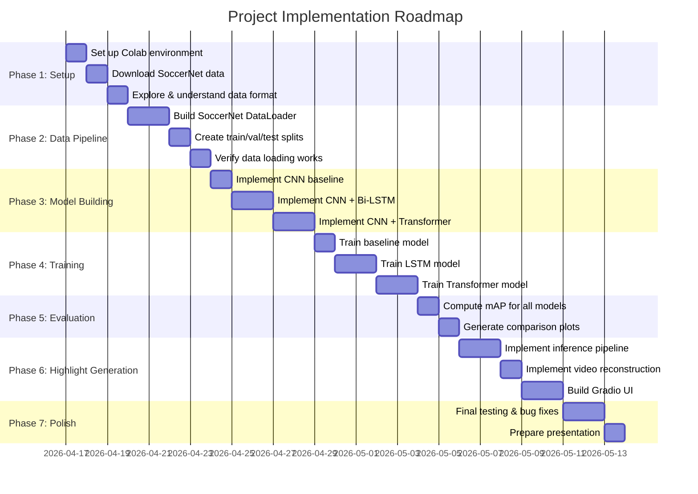

### 10.2 What You'll Have at the End

| Deliverable | Description |
|:---|:---|
| **Colab Notebook** | Complete, runnable, well-documented notebook |
| **3 Trained Models** | CNN baseline, CNN+LSTM, CNN+Transformer (saved as `.pth` files) |
| **Comparison Results** | mAP table + plots showing LSTM beats baseline, Transformer beats LSTM |
| **Sample Highlights** | Generated highlight videos from test matches |
| **Gradio/Streamlit UI** | Interactive demo for live presentation |
| **This Document** | Full system documentation for understanding & defense |

### 10.3 Local Project Structure (Your Mac)

```
/Users/vaibhav/Study/Sem 6/Deep Learning/Project/
├── System_Architecture_and_Workflow.md   ← THIS FILE (documentation)
├── idea.md                                ← Your notes
├── code.py                                ← Old reference code
├── github_repos/                          ← Cloned reference repositories
│   ├── Video-Summarization-with-LSTM/
│   ├── CA-SUM/
│   └── Video-Summarization-using-CNN-LSTM/
│
├── src/                                   ← OUR CODE (to be written next)
│   ├── config.py                          # All hyperparameters
│   ├── dataset.py                         # SoccerNet data loading
│   ├── models/
│   │   ├── __init__.py
│   │   ├── baseline_cnn.py                # Model A: CNN-only
│   │   ├── lstm_model.py                  # Model B: CNN + Bi-LSTM
│   │   └── transformer_model.py           # Model C: CNN + Transformer
│   ├── train.py                           # Training loop with early stopping
│   ├── evaluate.py                        # mAP computation
│   ├── inference.py                       # Run model on new videos
│   ├── highlight_generator.py             # Knapsack + video reconstruction
│   ├── visualize.py                       # Plot generation
│   └── utils.py                           # Helper functions
│
├── notebooks/
│   └── Football_Highlight_Detection.ipynb # MAIN COLAB NOTEBOOK
│
└── results/                               ← Generated outputs
    ├── plots/
    ├── metrics/
    └── highlights/
```

---

## ❓ Chapter 11: Anticipating Questions (Viva Prep)

| Question | Answer |
|:---|:---|
| Why not train CNN from scratch? | Transfer learning is far more efficient. ImageNet features generalize well. Training from scratch needs millions of images we don't have. |
| Why 2 FPS and not higher? | Events span 10-30 seconds. At 2fps we get 20-60 frames per event — sufficient. Higher FPS = more computation with diminishing returns. |
| Why Bi-LSTM and not unidirectional? | Events have both build-up (before) and aftermath (after). Bidirectional captures both directions. |
| Why not just use the Transformer? | We compare 3 models to demonstrate understanding. Also, LSTM is simpler and may perform comparably with less data. |
| What is the Knapsack algorithm? | A Dynamic Programming optimization that selects the best subset of clips under a time-budget constraint (e.g., max 10 min of highlights). |
| Why SoccerNet and not your own dataset? | SoccerNet has 500+ matches with professional annotations. Creating our own dataset would take months. It's also a recognized benchmark. |
| What does mAP measure? | How accurately the model predicts event timestamps, averaged across all event classes. Higher = better. |
| What is Length Regularization? | A loss term that penalizes the model if it predicts too many frames as events. Prevents the trivial solution of marking everything as a highlight. |
| How is this different from generic video summarization? | We detect **specific labeled events** (supervised) rather than "visually interesting" frames (unsupervised). Our output has event classes + timestamps, not just importance scores. |
| Can this work in real-time? | Not with this architecture (needs the full sequence). For real-time, you'd use a causal model that only looks at past frames. That's future work. |

---

## 🎯 Chapter 12: Summary — The One-Page Version

```
PROJECT: AI-Based Football Highlight Detection using Deep Learning

PROBLEM:  Automatically detect events (goals, cards, fouls) in football match
          videos and generate highlight reels.

DATASET:  SoccerNet v2 — 500+ matches, pre-extracted ResNet features at 2fps,
          timestamped event labels.

MODELS:   1) CNN-only baseline (no temporal context)
          2) CNN + Bi-LSTM (sequential temporal modeling) ← PRIMARY
          3) CNN + Transformer (attention-based temporal modeling) ← ADVANCED

PIPELINE: Load features → Sliding window sequences → Temporal model →
          Event classifier → Threshold + NMS → Knapsack selection →
          Extract video clips → Highlight reel

METRIC:   mean Average Precision (mAP) at temporal tolerances of ±5/10/30/60s

UI:       Gradio web interface for live demo during presentation

PLATFORM: Google Colab (free T4 GPU) + Google Drive (persistent storage)

KEY REFERENCES:
  - Zhang et al. (ECCV 2016) — LSTM for video summarization
  - Apostolidis et al. (ICMR 2022) — Concentrated Self-Attention + Knapsack
  - CNN-LSTM repo — End-to-end pipeline template
```

---

# PART E: DATA MANAGEMENT — NEVER LOSE ANYTHING

---

## 💾 Chapter 13: Storage Math & Subset Strategy

### 13.1 The Storage Problem

| Resource | Free Tier Limit |
|:---|:---|
| Google Drive | **15 GB** total (shared with Gmail, Photos) |
| Colab local disk (`/content/`) | **~78 GB** (but wiped every session) |
| Colab RAM | **12.7 GB** |
| Colab GPU VRAM (T4) | **15 GB** |

Full SoccerNet ResNet features = **~120 GB**. That's 8x your free Drive. We MUST use a subset.

### 13.2 Exact Size Calculation for a Subset

Each SoccerNet match has:
- `1_ResNET_TF2.npy` (first half) ≈ **~11 MB** (5400 frames × 512 floats × 4 bytes)
- `2_ResNET_TF2.npy` (second half) ≈ **~11 MB**
- `Labels-v2.json` ≈ **~5 KB**
- **Total per match ≈ 22 MB**

| Subset Size | Feature Storage | Labels | Total | Fits in 15GB Drive? |
|:---|:---|:---|:---|:---|
| 50 matches | 1.1 GB | ~0.3 MB | **~1.1 GB** | ✅ YES (plenty of room) |
| 100 matches | 2.2 GB | ~0.5 MB | **~2.2 GB** | ✅ YES |
| 200 matches | 4.4 GB | ~1 MB | **~4.4 GB** | ✅ YES |
| 300 matches | 6.6 GB | ~1.5 MB | **~6.6 GB** | ⚠️ Tight (need room for checkpoints) |
| 500 matches (full) | 11 GB | ~2.5 MB | **~11 GB** | ❌ NO (no room for checkpoints/results) |

**Recommended: 100-200 matches** — gives enough training data while leaving ~10 GB for checkpoints, results, and other Drive files.

### 13.3 How to Download ONLY a Subset

The SoccerNet downloader downloads the **entire split** by default. To get a subset, we use a smart approach:

```python
# STRATEGY: Download to Colab local disk first, then copy only what we need to Drive

import os
import shutil
import random

# Step 1: Download ALL to Colab local disk (78GB available, wiped each session)
from SoccerNet.Downloader import SoccerNetDownloader
downloader = SoccerNetDownloader(LocalDirectory="/content/SoccerNet_full")
downloader.downloadGames(
    files=["1_ResNET_TF2.npy", "2_ResNET_TF2.npy"],
    split=["train", "valid", "test"]
)
downloader.downloadDataTask(task="spotting", split=["train", "valid", "test"])

# Step 2: Find all match directories
all_matches = []
for root, dirs, files in os.walk("/content/SoccerNet_full"):
    if "Labels-v2.json" in files:
        all_matches.append(root)

print(f"Total matches found: {len(all_matches)}")

# Step 3: Randomly select 150 matches (100 train, 25 val, 25 test)
random.seed(42)  # reproducible
random.shuffle(all_matches)
selected = all_matches[:150]

# Step 4: Copy ONLY selected matches to Google Drive
DRIVE_DATA = "/content/drive/MyDrive/DL_Project/data/SoccerNet_subset"
for match_dir in selected:
    # Preserve relative path structure
    rel_path = os.path.relpath(match_dir, "/content/SoccerNet_full")
    dest = os.path.join(DRIVE_DATA, rel_path)
    os.makedirs(dest, exist_ok=True)
    
    for f in ["1_ResNET_TF2.npy", "2_ResNET_TF2.npy", "Labels-v2.json"]:
        src = os.path.join(match_dir, f)
        if os.path.exists(src):
            shutil.copy2(src, dest)

print(f"✅ Copied {len(selected)} matches to Drive")
print(f"Approx size: {len(selected) * 22 / 1024:.1f} GB")
```

> **Run this ONCE.** After this, the subset lives permanently on your Google Drive. Every future Colab session just loads from Drive — no re-downloading needed.

### 13.4 Alternative: Even Smaller Quick-Start (20 matches)

If you just want to test that your code works before committing to a big download:

```python
# Download only 20 matches for rapid prototyping
selected_quick = all_matches[:20]  # ~440 MB total
# ... same copy logic as above
```

This lets you test the entire pipeline in minutes, then scale up to 150+ matches for final training.

---

## 🔒 Chapter 14: Zero Data Loss Strategy

### 14.1 What Could Go Wrong

| Risk | Impact | Probability |
|:---|:---|:---|
| Colab session disconnects mid-training | Lose current epoch progress | **HIGH** (happens every few hours) |
| Google Drive runs out of space | Can't save checkpoints | MEDIUM |
| Accidentally delete files | Lose trained models | LOW |
| Colab local disk wiped | Lose anything in `/content/` | **CERTAIN** (every session) |

### 14.2 The Three-Layer Backup Plan

```
Layer 1: Google Drive (persistent, automatic)
         ├── checkpoints saved after EVERY epoch
         ├── best model saved separately
         └── results/metrics saved after every eval

Layer 2: Zip backup (manual, periodic)
         ├── zip entire checkpoints folder after training
         └── download zip to your Mac

Layer 3: Local Mac (final copy)
         └── download finished models + results to your Mac
```

### 14.3 Auto-Save After Every Epoch (Built Into Training Code)

This will be baked into our training loop — you don't need to do anything manually:

```python
# Inside training loop — saves to Drive automatically
CHECKPOINT_DIR = "/content/drive/MyDrive/DL_Project/checkpoints"

for epoch in range(num_epochs):
    train_loss = train_one_epoch(model, train_loader, optimizer)
    val_map = evaluate(model, val_loader)
    
    # === SAVE EVERY EPOCH (Layer 1) ===
    checkpoint = {
        'epoch': epoch,
        'model_state_dict': model.state_dict(),
        'optimizer_state_dict': optimizer.state_dict(),
        'train_loss': train_loss,
        'val_map': val_map,
        'config': CONFIG,
    }
    torch.save(checkpoint, f"{CHECKPOINT_DIR}/model_epoch_{epoch}.pth")
    
    # === SAVE BEST MODEL SEPARATELY ===
    if val_map > best_map:
        best_map = val_map
        torch.save(checkpoint, f"{CHECKPOINT_DIR}/best_model.pth")
        print(f"🏆 New best model! mAP: {val_map:.4f}")
    
    # === SAVE TRAINING LOG ===
    with open(f"{CHECKPOINT_DIR}/training_log.txt", "a") as f:
        f.write(f"Epoch {epoch}: loss={train_loss:.4f}, val_mAP={val_map:.4f}\n")
    
    print(f"Epoch {epoch}: loss={train_loss:.4f}, val_mAP={val_map:.4f} ✅ Saved to Drive")
```

### 14.4 Resume Training After Disconnect

When Colab disconnects and you reconnect:

```python
# Check if a checkpoint exists
import glob
checkpoints = sorted(glob.glob(f"{CHECKPOINT_DIR}/model_epoch_*.pth"))

if checkpoints:
    # Resume from last saved epoch
    last_ckpt = checkpoints[-1]
    print(f"🔄 Resuming from: {last_ckpt}")
    checkpoint = torch.load(last_ckpt)
    model.load_state_dict(checkpoint['model_state_dict'])
    optimizer.load_state_dict(checkpoint['optimizer_state_dict'])
    start_epoch = checkpoint['epoch'] + 1
    best_map = checkpoint.get('val_map', 0)
    print(f"   Epoch: {start_epoch}, Best mAP: {best_map:.4f}")
else:
    print("🆕 No checkpoint found. Starting from scratch.")
    start_epoch = 0
    best_map = 0

# Continue training from where you left off
for epoch in range(start_epoch, num_epochs):
    # ... training continues seamlessly
```

### 14.5 Zip Backup Strategy (After Training is Complete)

```python
# Run this cell after training is done
import zipfile
import datetime

timestamp = datetime.datetime.now().strftime("%Y%m%d_%H%M")
zip_name = f"/content/drive/MyDrive/DL_Project/backup_{timestamp}.zip"

with zipfile.ZipFile(zip_name, 'w', zipfile.ZIP_DEFLATED) as zipf:
    # Backup checkpoints
    for f in glob.glob(f"{CHECKPOINT_DIR}/*.pth"):
        zipf.write(f, os.path.basename(f))
    
    # Backup results
    results_dir = "/content/drive/MyDrive/DL_Project/results"
    for f in glob.glob(f"{results_dir}/*"):
        zipf.write(f, f"results/{os.path.basename(f)}")
    
    # Backup training log
    log_file = f"{CHECKPOINT_DIR}/training_log.txt"
    if os.path.exists(log_file):
        zipf.write(log_file, "training_log.txt")

print(f"✅ Backup saved: {zip_name}")
print(f"   Size: {os.path.getsize(zip_name) / 1024 / 1024:.1f} MB")
```

### 14.6 Download to Your Mac (Final Safety Net)

```python
# Option A: Download zip from Colab
from google.colab import files
files.download(zip_name)  # Downloads to your Mac's Downloads folder

# Option B: Direct access via Google Drive web
# Go to drive.google.com → DL_Project → download the zip
```

### 14.7 What Gets Saved Where — Complete Map

```
PERMANENT (survives everything):
├── Google Drive/DL_Project/data/SoccerNet_subset/
│   └── 150 matches of features + labels (~3.3 GB)
│   └── ⚡ Downloaded ONCE, never changes
│
├── Google Drive/DL_Project/checkpoints/
│   ├── model_epoch_0.pth through model_epoch_99.pth
│   ├── best_model.pth  ← THE FINAL MODEL
│   ├── training_log.txt
│   └── ⚡ Auto-saved every epoch
│
├── Google Drive/DL_Project/results/
│   ├── training_curves.png
│   ├── confusion_matrix.png
│   ├── model_comparison.png
│   ├── metrics.json
│   └── ⚡ Saved after evaluation
│
├── Google Drive/DL_Project/backup_YYYYMMDD.zip
│   └── ⚡ Manual zip after training
│
└── Your Mac/Downloads/backup_YYYYMMDD.zip
    └── ⚡ Downloaded as final safety copy

TEMPORARY (wiped every Colab session):
└── /content/  ← Colab local SSD
    └── Used only for fast data loading during a session
    └── NOTHING important stored here permanently
```

### 14.8 Storage Budget (With 15GB Free Drive)

| Item | Size | Running Total |
|:---|:---|:---|
| SoccerNet subset (150 matches) | ~3.3 GB | 3.3 GB |
| Checkpoints (keep last 5 + best) | ~0.1 GB | 3.4 GB |
| Results (plots, metrics) | ~0.05 GB | 3.45 GB |
| Zip backup | ~0.1 GB | 3.55 GB |
| **Remaining free Drive space** | | **~11.4 GB** ✅ |

Plenty of room. Even with Gmail and Photos using some space, you'll be fine.

---

# PART F: RENDERING MERMAID DIAGRAMS

---

## 🖼️ Chapter 15: How to See the Mermaid Diagrams

The Mermaid diagrams in this file won't render in VS Code's default Markdown preview. Here are your options:

### Option 1: Install VS Code Extension (Recommended)

1. Open VS Code
2. Press `Cmd + Shift + X` (Extensions panel)
3. Search for **"Markdown Preview Mermaid Support"** by Matt Bierner
4. Click **Install**
5. Now open this file and press `Cmd + Shift + V` to preview — all diagrams will render

### Option 2: View on GitHub

Push this file to a GitHub repository. GitHub **natively renders** Mermaid diagrams in `.md` files. No extensions needed.

```bash
cd "/Users/vaibhav/Study/Sem 6/Deep Learning/Project"
git init
git add System_Architecture_and_Workflow.md
git commit -m "Add system architecture doc"
git remote add origin https://github.com/YOUR_USERNAME/YOUR_REPO.git
git push -u origin main
```

Then open the file on github.com — all diagrams render perfectly.

### Option 3: Mermaid Live Editor (Instant, No Install)

1. Go to [mermaid.live](https://mermaid.live/)
2. Copy any mermaid code block from this file (just the content between the triple backticks)
3. Paste it in the editor
4. See the rendered diagram instantly
5. Download as PNG/SVG for your presentation slides

### Option 4: View in Colab Notebook

When we build the Colab notebook, diagrams will be embedded as images (generated from Mermaid). They'll render natively in the notebook.

---

> **You are now fully prepared.** This document covers everything from basic concepts to advanced architecture, from Colab cell-by-cell workflow to zero-data-loss backup strategy. When you're ready to start coding, just say the word.
